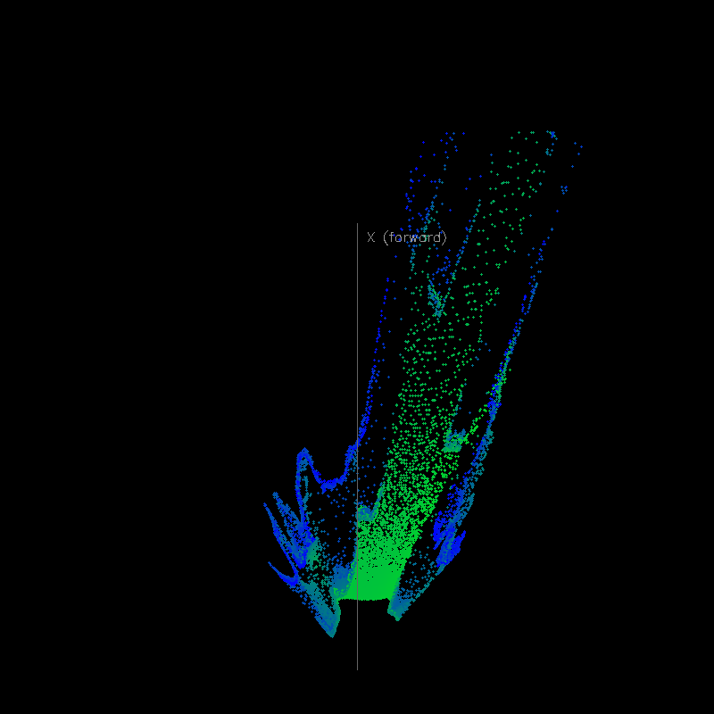
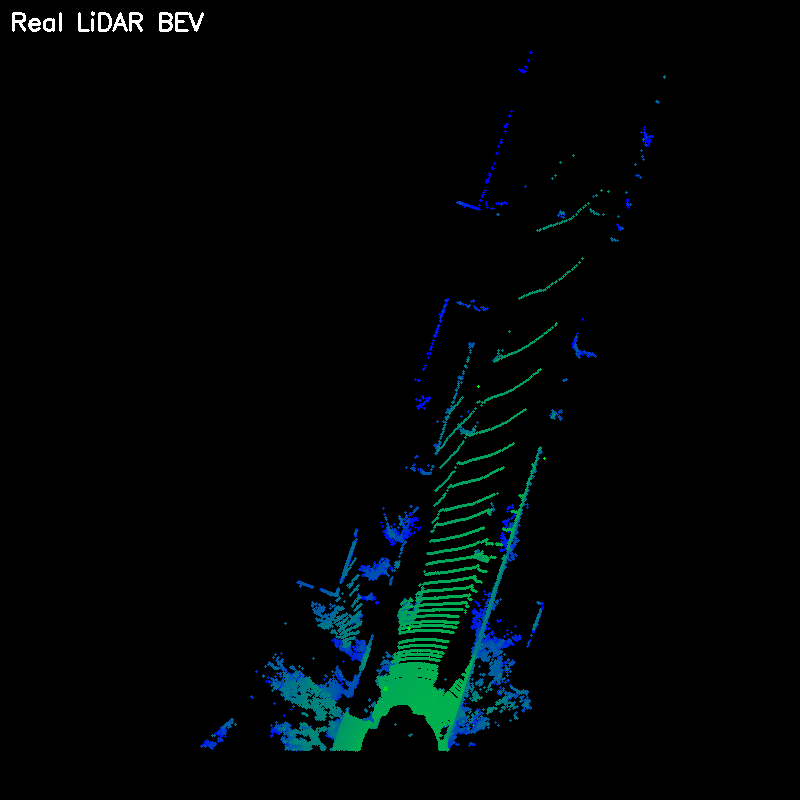
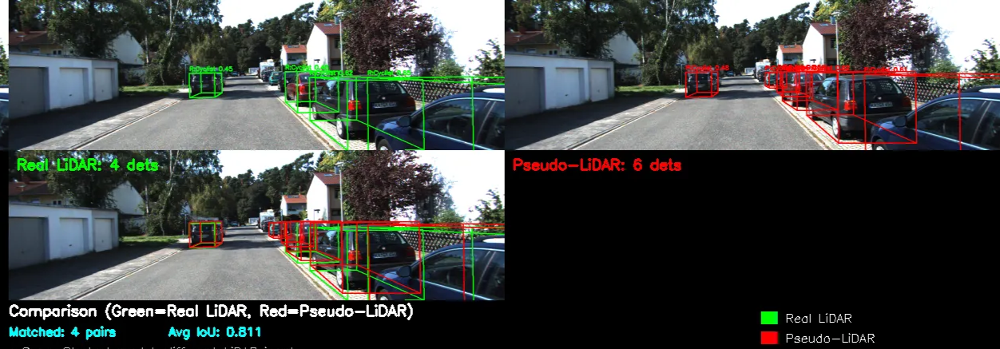

# 최종 발표 자료 (1)

## 1. 프로젝트 개요

- 프로젝트 주제
    - Knowledge Distillation(KD)을 이용한 3D Object Detection
- 사용 데이터셋
    - KITTI
- 주제 선정 배경
    - KITTI 데이터셋 : 카메라로 촬영된 RGB 이미지 + Velodyne으로 측정된 LiDAR 정보 포함
    - LiDAR 정보를 이용하면 매우 높은 정확도로 object의 depth를 추정할 수 있지만, 실제 자율주행 자동차 환경에서는 LiDAR 정보가 주어지기가 쉽지 않음
        - 모든 자율주행 자동차에 초고가의 LiDAR 측정 장치를 설치하기에는 비용이 매우 커지기 때문
    - 실제 자율주행 자동차 환경에서 저비용으로 모델을 구현하기 위해서는 LiDAR 없이 이미지만으로 object detection을 수행하는 모델을 구현하고자 함
        - LiDAR 정보가 있다면 depth 추정의 정확도가 매우 높아짐
            
            → 모델 학습 과정에서는 LiDAR 정보를 이용하고, 실제 추론 과정에서는 이미지만을 이용해 detection을 수행하도록 모델을 설계
            
- 목표 및 기대효과
    - LiDAR 정보 없이 이미지만 주어졌을 때 3d object detection을 수행
    - 학습 과정에서는 LiDAR 정보를 이용하기 때문에 기존의 camera-based model (e.g. FCOS3D, ImVoxelNet 등)보다 높은 성능을 보일 것
    - 아래 이미지는 모델의 종류별 대략적인 성능을 시각화
        - 모델 구분 : Camera-only, LiDAR-only, Multi-modal (Camera + LiDAR)
        
        

        
    - LiDAR 정보가 주어지지 않더라도 LiDAR 정보를 이용하는 것과 비슷한 수준의 성능을 이끌어내는 것이 최종적인 목표

## 2. 프로젝트 과정

- 전체 파이프라인
    1. 데이터셋 준비 : KITTI - image + velodyne(LiDAR)
    2. 이미지로부터 Pseudo-LiDAR를 예측
    3. Knowledge Distillation을 이용하여 Student Model을 Finetuning
        1. Teacher Model은 Image + True LiDAR를 입력으로 받음
        2. Student Model은 Image + Pseudo-LiDAR를 입력으로 받음 
    4. Student Model을 이용해서 Validation / Test 수행
    
- 모델 구조
    - Depth Estimation Model
        - 목적 : 입력 이미지로부터 Pseudo-LiDAR를 예측
        - 학습 방법 : True LiDAR를 label로 취급하여 모델이 Pseudo-LiDAR를 생성하도록 학습
        - 프로젝트에서 수행한 방법 : KITTI 데이터셋에서 사전학습된 모델을 불러와 이용
        - input : Image
        - output : Pseudo-LiDAR
        - e.g. BTS, ***GLPN*** 등
    - Teacher Model
        - 목적 : Student Model의 LiDAR 정보 학습을 위한 Feature space, prediction 생성
        - 학습 방법 : 이미지와 LiDAR를 입력으로 받아 Detection Error를 최소화하도록 학습
        - 프로젝트에서 수행한 방법 : KITTI 데이터셋에서 사전학습된 모델을 불러와 이용
        - input : Image + True LiDAR
        - output : -
        - e.g. ***MVX-Net***, ImVoteNet 등
    - Student Model
        - 목적 : Teacher Model로부터 LiDAR 정보를 전달받아 Pseudo-LiDAR 정보를 바탕으로 3D Object Detection을 수행
        - 학습 방법 : 이미지와 Pseudo-LiDAR를 입력으로 받아 Detection Error + Feature Error + Logit Error를 최소화하도록 학습
        - 프로젝트에서 수행한 방법 : KITTI 데이터셋에서 사전학습된 모델을 불러와 Finetuning 수행
        - input : Image + Pseudo-LiDAR
        - output : 3d object detection (class + bounding box)
        - e.g. ***MVX-Net***, ImVoteNet 등
    - 모델 구조 시각화
        
        
        

- 특이사항
    - 데이터 전처리
        - Depth Estimation Model이 예측한 Pseudo-LiDAR의 경우 실제 LiDAR에 비해 1/8 스케일
            
            ⇒ 원래의 예측값에 SCALE_FACTOR = 8을 곱
            
        - Pseudo-LiDAR의 경우 실제 LiDAR에 비해 points가 너무 빽빽하게 분포
            
            ⇒ 원래의 예측에서 10% 수준으로 다운샘플링 수행
            
    - 3D Object Detection 관련 오픈소스 라이브러리인 MM Detection 3D 이용
        - 발생한 문제 : 코랩 환경과 라이브러리의 의존성 문제
        - 해결 방안 : 코랩 내에서 Mini-conda를 이용해 가상환경을 생성 후 가상환경 내에 라이브러리 설치 및 활용
    - Teacher Model과  Student Model은 동일한 모델을 사용
        - 예상 문제 : 두 모델이 동일한 가중치로 초기화되기 때문에 Feature Space가 동일해지도록 학습이 될 가능성 존재
        - 해결 방안 : Teacher Model의 Feature Space와 Student Model의 Feature Space를 직접 비교하지 않고, Student Model의 Feature Space를 1D Conv 레이어를 통과시켜 Teacher Model의 Feature Space로 projection되도록 한 뒤 비교

## 3. 프로젝트 결과

- 모델 파라미터

| **모델** | **백본** | **추정 파라미터 수** |
| --- | --- | --- |
| **MVXNet** | VoxelNet 기반 | 약 20-30M |
| **PGD** | ResNet-101 + FPN | 약 45-50M |
| **ImVoxelNet** | ResNet-50 + FPN | 약 30-35M |
| SMOKE | DLA-34 | 약 20-22M |
| ***Our Project*** | GLPN + MVXNET | 약 34M  |
- camera based 모델에 비해 파라미터 수 차이가 그렇게 크지 않지만 성능은 실제 라이다 모델과 비슷한 성능을 보임

                           **Pseudo LiDAR                                                                    Real LiDAR**

### Pseudo LiDAR

## Real LiDAR

### 최종 3D Object Detection 결과

## Kitti 데이터셋 이외의 이미지로 성능 평가

- nano banana를 이용해 이미지 생성

### 기존 모델과 프로젝트 최종 모델의 3D Object Detection 비교

### 이외의 동영상을 이용한 실시간 탐지

## 4.  마무리 : 개선 및 확장 방안

- 다른 종류의 모델을 적용
    - Depth Estimation Model 및 Multi-modal Model의 종류를 다르게 해보기
    - 시간 부족으
- 

## 5. 배운 점
